# 🚀 Proxmox Infrastructure as Code

<!-- markdownlint-disable MD013 -->

[](https://www.terraform.io/)
[](https://www.ansible.com/)
[](https://www.proxmox.com/)
[](https://docs.gitlab.com/ee/ci/)
[](https://www.gitops.tech/)
[](https://docs.renovatebot.com/)
[](https://docs.docker.com/compose/)
[](https://www.debian.org/)
[](https://ubuntu.com/)

<!-- markdownlint-enable MD013 -->

Complete Infrastructure as Code solution for managing Proxmox
infrastructure: LXC containers, Linux VMs, Windows VMs, and K3s clusters.

Three-phase workflow: **Terraform** provisions → **Ansible** configures →
**GitLab CI/CD** deploys

<!-- markdownlint-disable MD051 -->

[Quick Start](#-quick-start) • [Architecture](#architecture) •
[Documentation](#-detailed-documentation) •
[Troubleshooting](#-troubleshooting)

<!-- markdownlint-enable MD051 -->

---

## 📋 Table of Contents

<!-- markdownlint-disable MD051 -->

- [Overview](#-overview)
- [Quick Start](#-quick-start)
- [Architecture](#architecture)
  - [Three-Phase Workflow](#three-phase-workflow)
  - [System Architecture](#system-architecture)
  - [Deployment Pipeline](#deployment-pipeline)
- [Phase Details](#-phase-details)
  - [Phase 1: Terraform (Infrastructure)](#phase-1-terraform-infrastructure)
  - [Phase 2: Ansible (Configuration)](#phase-2-ansible-configuration)
  <!-- markdownlint-disable-next-line MD013 -->
  - [Phase 3: GitLab CI/CD (Service Deployment)](#phase-3-gitlab-cicd-service-deployment)
- [Prerequisites](#-prerequisites)
- [Complete Workflow](#-complete-workflow)
- [Security Model](#-security-model)
- [Key Concepts](#-key-concepts)
- [Common Operations](#common-operations)
- [Project Structure](#project-structure)
- [Best Practices](#-best-practices)
- [Troubleshooting](#-troubleshooting)
- [Detailed Documentation](#-detailed-documentation)

<!-- markdownlint-enable MD051 -->

---

## 🎯 Overview

This repository implements a **complete Infrastructure as Code (IaC)**
solution for managing Proxmox infrastructure (LXC containers, Linux VMs,
Windows VMs, and K3s clusters) using a **three-phase GitOps workflow**.
From bare infrastructure to production-ready services, everything is
automated, version-controlled, and follows DevOps best practices.

### ✨ Key Features

- 🏗️ **Infrastructure as Code** - Terraform manages all Proxmox resources
  declaratively
- 🔧 **Configuration Management** - Ansible ensures consistent,
  reproducible configurations
- 🚀 **GitOps Deployment** - GitLab CI/CD automatically deploys services
  on every push
- 🔐 **Security First** - Unique SSH keys, hardened configurations,
  encrypted secrets
- 📊 **Zero-Downtime** - Rolling deployments with health checks
- 🔄 **Idempotent** - Safe to re-run any phase without side effects
- 📝 **Version Controlled** - All infrastructure, configs, and secrets in Git
- ⚡ **Fast Deployments** - Service deployments complete in ~30 seconds

### 🎬 What This Solves

**Before**: Manual container creation, inconsistent configurations,
error-prone deployments, no audit trail

**After**: Automated provisioning, consistent configurations,
zero-touch deployments, complete version history

---

## ⚡ Quick Start

Get started in **4 simple steps**:

```bash
# 1️⃣ Provision infrastructure with Terraform
cd terraform/lxc                    # Or terraform/linux-vms, terraform/windows-vms
make apply                          # Creates infrastructure on Proxmox

# 2️⃣ Sync inventory and accept host keys
cd ../ansible
make inventory-all                  # Sync inventory from all Terraform projects
make accept-host-keys               # Accept SSH fingerprints (security)

# 3️⃣ Bootstrap and configure hosts
make bootstrap-host HOST=<hostname> # Create user, harden SSH (one-time)
make configure-host HOST=<hostname> # Install Docker, setup environment (one-time)

# 4️⃣ Deploy services (automatic!)
git push                            # GitLab CI/CD deploys changed services
# Note: Main branch requires manual approval, tags auto-deploy
```

**✨ Result**: Production-ready LXC containers with Docker, hardened
SSH, and automated service deployments!

> **💡 Pro Tip**: Start with one container to test the workflow, then scale up.

---

## 🏗️ Architecture

### Three-Phase Workflow

```mermaid
flowchart LR
    A[Terraform<br/>Phase 1] -->|Provisions| B[Ansible<br/>Phase 2]
    B -->|Configures| C[GitLab CI/CD<br/>Phase 3]

    A -->|Creates Infrastructure| A1["• LXC Containers<br/>• Linux/Windows VMs<br/>• Generate SSH keys<br/>• Output inventory"]
    B -->|One-Time Setup| B1["• Create users<br/>• Install Docker/Podman<br/>• Harden SSH<br/>• Setup /srv/docker/"]
    C -->|On Every Push| C1["• Auto-detect changes<br/>• Validate configs<br/>• Deploy services<br/>• Health checks"]

    style A fill:#623CE4,color:#fff
    style B fill:#EE0000,color:#fff
    style C fill:#FC6D26,color:#fff
```

<!-- markdownlint-disable MD040 -->



<!-- markdownlint-enable MD040 -->

### System Architecture

<!-- markdownlint-disable MD040 -->


<!-- markdownlint-enable MD040 -->

### Deployment Pipeline

```mermaid
flowchart TD
    START(["git push origin main"]) --> BUILD
    BUILD["🔨 Build<br/>Custom Docker images"] --> LINT
    LINT["✅ Lint<br/>ShellCheck validation"] --> DETECT
    DETECT["🔍 Detect<br/>Changed services"] --> VALIDATE
    VALIDATE["📋 Validate<br/>docker-compose.yml"] --> PREFLIGHT
    PREFLIGHT["🏥 Preflight<br/>SSH, Docker, disk checks"] --> BACKUP
    BACKUP["💾 Backup<br/>Automated backup"] --> DEPLOY
    DEPLOY["🚀 Deploy<br/>Manual approval on main"] --> VERIFY
    VERIFY["✓ Verify<br/>Health checks"] --> END(["Deployment Complete"])

    style BUILD fill:#623CE4,color:#fff
    style LINT fill:#4CAF50,color:#fff
    style DETECT fill:#2196F3,color:#fff
    style VALIDATE fill:#FF9800,color:#fff
    style PREFLIGHT fill:#9C27B0,color:#fff
    style BACKUP fill:#795548,color:#fff
    style DEPLOY fill:#F44336,color:#fff
    style VERIFY fill:#4CAF50,color:#fff
```

<!-- markdownlint-disable MD040 -->



<!-- markdownlint-enable MD040 -->


*Full 9-stage CI/CD pipeline in action*

---

## 🏆 Achievements & Infrastructure Scale

This project showcases enterprise-grade infrastructure automation
practices applied to homelab/production environments:

<!-- markdownlint-disable MD013 -->

| Category                      | Scale             | Technical Highlight                                                |
| ----------------------------- | ----------------- | ------------------------------------------------------------------ |
| **Infrastructure Types**      | 4 platforms       | LXC Containers, Linux VMs, Windows VMs, K3s Clusters               |
| **Production Services**       | 8 services        | Pi-hole (2x), AdGuard (2x), Unbound (2x), Semaphore, Paperless-NGX |
| **Managed LXC Containers**    | 5 containers      | Automated provisioning & configuration via Terraform + Ansible     |
| **Managed Linux VMs**         | 8 VMs             | Including 6-node K3s cluster (3 masters + 3 workers)               |
| **Custom Ansible Roles**      | 7 roles           | Modular configuration management with role dependencies            |
| **CI/CD Pipeline Complexity** | 9 stages, 12 jobs | Comprehensive validation, approval gates, health checks            |
| **Custom Docker Images**      | 3 images          | CI tooling, enhanced Pi-hole, Unbound DNS resolver                 |
| **Documentation**             | 32+ files         | 1,193+ lines in main README, comprehensive technical docs          |

<!-- markdownlint-enable MD013 -->

### 🔑 Key Technical Innovations

- **🔐 Per-Host SSH Key Generation** - Zero-trust security model with
  unique ED25519 keys per infrastructure component, automatically generated
  and managed by Terraform
- **♻️ Checksum-Based Idempotency** - Intelligent deployment system that
  compares checksums to skip unchanged services, reducing deployment time
  and preventing unnecessary restarts
- **🎯 6-Node Production K3s Cluster** - High-availability Kubernetes
  cluster with automated deployment, rolling updates, and comprehensive
  health monitoring
- **💾 Backup-Before-Deploy Pattern** - Automated backup creation before
  every deployment with retention policy (last 5 backups), enabling
  instant rollback capabilities
- **🏗️ Three-Phase GitOps Workflow** - Separation of concerns: Terraform
  (infrastructure), Ansible (configuration), GitLab CI/CD (services) with
  clear phase boundaries
- **📦 Modular Terraform Design** - Separate state management per
  infrastructure type (LXC/Linux VMs/Windows VMs) enabling independent
  lifecycle management
- **📚 Shared CI/CD Library** - Reusable shell function library
  (`common.sh`, `docker.sh`, `ssh.sh`) promoting DRY principles across
  pipeline stages

---

## 📦 Phase Details

### Phase 1: Terraform (Infrastructure) 🏗️

**Purpose**: Provision Proxmox infrastructure (LXC containers, Linux VMs,
Windows VMs, K3s clusters)

**What it does**:

- ✅ **Creates LXC containers** with custom specifications (CPU, RAM, disk)
- ✅ **Creates Linux VMs** with cloud-init support (Debian/Ubuntu)
- ✅ **Creates Windows VMs** with cloudbase-init support
- ✅ **Generates unique ED25519 SSH key pairs** per host (stored in `~/.ssh/`)
- ✅ **Configures static IPs** and network settings
- ✅ **Outputs Ansible-ready inventory** with IPs and SSH keys
- ✅ **Manages infrastructure lifecycle** (create, update, destroy)

**Key Features**:

- 🔑 **Unique SSH keys** - Each host gets its own key pair
- 📝 **Declarative configuration** - Define infrastructure in HCL
- 🔄 **State management** - Track infrastructure changes
- 📊 **Outputs** - Generate inventory for Ansible
- 🏗️ **Modular design** - Separate projects for each infrastructure type

**Location**: [`terraform/`](./terraform/README.md)

**Project Structure**:

- `terraform/lxc/` - LXC container provisioning
- `terraform/linux-vms/` - Linux VM provisioning
- `terraform/windows-vms/` - Windows VM provisioning

**Example**:

```text
module "lxc_instances" {
  source = "./modules/lxc"

  lxc_instances = [
    {
      hostname     = "pihole-1"
      vmid         = 100
      ip           = "10.10.0.10/24"
      cores        = 2
      memory       = 2048
      disk_size    = "20G"
    }
  ]
}
```

### Phase 2: Ansible (Configuration) 🐧

**Purpose**: Configure infrastructure from base OS to production-ready state

**What it does**:

#### Bootstrap (One-Time Setup - LXC/Linux VMs)

- ✅ **Creates non-root user** (`maintainer`) with sudo access
- ✅ **Copies SSH keys** from root to user account
- ✅ **Disables root SSH login** (security hardening)
- ✅ **Locks root password**
- ✅ **Configures passwordless sudo**

#### Configure (One-Time Setup - LXC/Linux VMs)

- ✅ **Installs Docker CE** and Docker Compose V2 (for LXC containers)
- ✅ **Installs Podman** (alternative container runtime)
- ✅ **Creates `/srv/docker/`** directory structure
- ✅ **Configures Docker daemon** with best practices
- ✅ **Sets up systemd** for service management
- ✅ **Applies security hardening**

#### K3s Cluster Management

- ✅ **Bootstrap K3s cluster** - Initial cluster deployment
- ✅ **Update cluster** - Rolling updates
- ✅ **Verify cluster** - Health checks and diagnostics
- ✅ **System updates** - Package management for cluster nodes

**Key Features**:

- 🔐 **Security hardening** - SSH key-only auth, disabled root login
- 🔄 **Idempotent** - Safe to re-run without side effects
- 📦 **Container runtime** - Docker CE or Podman installation
- 🎯 **Targeted execution** - Run on individual hosts
- 🎛️ **Multi-infrastructure** - Supports LXC, Linux VMs, Windows VMs, K3s

**Location**: [`ansible/`](./ansible/README.md)

**Workflow**:

```bash
# Sync inventory from all Terraform projects
make inventory-all

# Bootstrap (creates user, hardens SSH)
make bootstrap-host HOST=pihole-1

# Configure (installs Docker, sets up environment)
make configure-host HOST=pihole-1

# K3s cluster operations
make k3s-bootstrap    # Initial cluster deployment
make k3s-verify       # Verify cluster health
make k3s-update       # Rolling cluster update
```

### Phase 3: GitLab CI/CD (Service Deployment) 🚀

**Purpose**: Automated deployment of Docker services via GitOps with
comprehensive validation

**What it does**:

- ✅ **Lints scripts** - ShellCheck validation on CI/CD scripts
- ✅ **Detects changes** - Auto-discovers changed services via git diff
- ✅ **Builds images** - Custom Docker image builds (pihole, unbound)
- ✅ **Validates** docker-compose.yml files before deployment
- ✅ **Pre-flight checks** - SSH connectivity, Docker daemon, disk space
- ✅ **Backs up** - Automated backups before deployment
- ✅ **Deploys** services via SSH + Docker Compose (manual approval on main)
- ✅ **Verifies** deployments with health checks
- ✅ **Idempotent** - Checksum-based change detection (skips if unchanged)

**Pipeline Stages** (9 stages):

1. **build** - Custom Docker image builds (pihole, unbound, CI tools)
2. **lint** - ShellCheck validation
3. **renovate** - Automated dependency updates (scheduled)
4. **detect** - Service change detection
5. **validate** - Docker Compose validation
6. **preflight** - Infrastructure checks
7. **backup** - Automated backups
8. **deploy** - Service deployment (**manual approval on main**, auto on tags)
9. **verify** - Health checks and verification

**Key Features**:

- 🔄 **Checksum-based idempotency** - Skips deployment if unchanged
- 📊 **Comprehensive validation** - Multi-stage validation pipeline
- 🔔 **Manual approval gates** - Requires approval for main branch deployments
- 🎯 **Service metadata** - Configure via `.service.yml` files
- ⚡ **Tag-based auto-deploy** - Automatic deployment on git tags
- 🔍 **Smart change detection** - Only processes changed services
- 💾 **Automated backups** - State saved before every deployment

**Location**: [`.gitlab-ci.yml`](./.gitlab-ci.yml),
[`scripts/ci/`](./scripts/ci/), [`services/`](./services/)

**Workflow**: Push to main → manual approval → deployment, or tag → auto-deploy

**Example**:

```bash
# Edit a service
vim services/pihole-1/docker-compose.yml

# Commit and push
git add services/pihole-1/docker-compose.yml
git commit -m "feat(pihole-1): update configuration"
git push origin main

# ✨ GitLab CI/CD automatically:
#   1. Lints scripts
#   2. Detects pihole-1 changed
#   3. Validates docker-compose.yml
#   4. Runs pre-flight checks
#   5. Creates backup
#   6. Waits for manual approval (main branch)
#   7. Deploys to target host
#   8. Verifies deployment with health checks
```

---

## 📋 Prerequisites

### Control Node (Your Machine)

<!-- markdownlint-disable MD013 -->

- ✅ **Terraform** 1.14+ -
  [Installation Guide](https://learn.hashicorp.com/tutorials/terraform/install-cli)
- ✅ **Ansible** 2.20+ -
[Installation Guide](https://docs.ansible.com/ansible/latest/installation_guide/index.html)
<!-- markdownlint-enable MD013 -->
- ✅ **jq** - JSON processor (for inventory parsing)
- ✅ **SSH client** - Standard on Linux/macOS
- ✅ **Git** - Version control

**Installation** (macOS):

```bash
# Install via Homebrew
brew install terraform ansible jq

# Verify installations
terraform version
ansible --version
jq --version
```

### Proxmox VE Server

- ✅ **Proxmox VE** 9.0+ - [Download](https://www.proxmox.com/en/downloads)
- ✅ **API token** with appropriate permissions
- ✅ **Debian 13 LXC template** available
- ✅ **Network connectivity** to containers

**Proxmox Setup**:

1. Create API token in Proxmox web UI:
   - Datacenter → Permissions → API Tokens
   - Grant `Sys.Modify` and `Datastore.AllocateSpace` permissions

2. Download Debian 13 template:
   - Local → CT Templates → Templates
   - Download `debian-13-standard`

---

## 🚀 Complete Workflow

### Step 1: Configure Terraform Variables

```bash
cd terraform
cp config/terraform.tfvars.example terraform.tfvars
# Edit terraform.tfvars with your Proxmox credentials
```

**Required Variables**:

```text
proxmox_api_url  = "https://proxmox.example.com:8006/api2/json"
proxmox_api_token_id = "terraform@pam!terraform-token"
proxmox_api_token_secret = "your-secret-token"
```

### Step 2: Define Your Infrastructure

Edit `terraform/lxc/instances/lxc.auto.tfvars` to define your LXC containers:

```text
lxc_instances = [
  {
    hostname     = "pihole-1"
    vmid         = 100
    ip           = "10.10.0.10/24"
    gateway      = "10.10.0.1"
    cores        = 2
    memory       = 2048
    disk_size    = "20G"
    template     = "debian-13-standard"
  },
  {
    hostname     = "pihole-2"
    vmid         = 101
    ip           = "10.10.0.11/24"
    gateway      = "10.10.0.1"
    cores        = 2
    memory       = 2048
    disk_size    = "20G"
    template     = "debian-13-standard"
  }
]
```

### Step 3: Provision with Terraform

```bash
cd terraform/lxc              # Or terraform/linux-vms, terraform/windows-vms
make init                    # Initialize Terraform
make plan                    # Preview changes
make apply                   # Create infrastructure
make inventory               # Generate Ansible inventory
```

**Result**: Infrastructure created with root SSH access and unique SSH keys.

### Step 4: Configure with Ansible

```bash
cd ../ansible
make inventory-all                  # Sync inventory from all Terraform projects
make accept-host-keys               # Accept SSH fingerprints (security)

# Bootstrap each host (one at a time)
make bootstrap-host HOST=pihole-1   # Creates user, hardens SSH
make bootstrap-host HOST=pihole-2   # Repeat for each host

# Configure each host (one at a time)
make configure-host HOST=pihole-1   # Installs Docker, sets up /srv/docker
make configure-host HOST=pihole-2   # Repeat for each host
```

**Result**: Production-ready infrastructure with:

- ✅ Non-root user (`maintainer`) with sudo access
- ✅ Root SSH disabled
- ✅ Docker CE + Compose V2 installed (for LXC containers)
- ✅ `/srv/docker/` directory structure created

### Step 5: Deploy Services (Automatic!)

```bash
# Edit a service
vim services/pihole-1/docker-compose.yml

# Commit and push
git add services/pihole-1/docker-compose.yml
git commit -m "feat(pihole-1): update configuration"
git push origin main

# ✨ GitLab CI/CD automatically:
#   1. Detects pihole-1 changed
#   2. Validates docker-compose.yml
#   3. Runs pre-flight checks
#   4. Creates backup
#   5. Waits for manual approval (main branch)
#   6. Deploys to target host
#   7. Verifies deployment
```

**Note**: For automatic deployment without approval, use git tags:

```bash
git tag v1.0.0 && git push origin v1.0.0  # Auto-deploys all changed services
```

---

## 🔐 Security Model

### Terraform Phase (Initial State)

- ✅ **Generates unique SSH keys** per container (ED25519)
- ✅ **Injects public keys** into containers during creation
- ✅ **Root SSH enabled** (temporary, for bootstrap only)
- ✅ **Keys stored locally** in `~/.ssh/<hostname>_id_ed25519`

### Ansible Bootstrap Phase

- ✅ **Creates non-root user** with sudo access
- ✅ **Copies SSH keys** from root to user account
- ✅ **Disables root SSH login** (`PermitRootLogin no`)
- ✅ **Locks root password** (`usermod -L root`)
- ✅ **Configures passwordless sudo** for deployment user

### Post-Bootstrap (Production State)

- ✅ **SSH key-only authentication** (no passwords)
- ✅ **Non-root user** with passwordless sudo
- ✅ **Root login impossible** via SSH
- ✅ **Host key verification** enabled (`ansible.cfg`)
- ✅ **Strict SSH configuration** (no password auth, no root login)

### Secret Management

- ✅ **Ansible Vault** - Encrypted secrets in version control
  (`group_vars/all/vault.yml`)
- ✅ **GitLab CI/CD Variables** - SSH keys and environment variables
  (per service/host)
- ✅ **`.env` files** - Generated from GitLab CI/CD variables during deployment
- ✅ **Terraform secrets** - `terraform.tfvars.secret` (gitignored, local only)
- ✅ **No plaintext secrets** - All credentials encrypted or in secrets

**Secret Naming Convention** (GitLab CI/CD):

- SSH Key: `SSH_KEY_<HOST>` (e.g., `SSH_KEY_PIHOLE_1`)
- Target IP: `HOST_<HOST>` (e.g., `HOST_PIHOLE_1`)
- Service Env: `ENV_<SERVICE>` (e.g., `ENV_PIHOLE_1`)

**Transformation**: `pihole-1` → `PIHOLE_1` (hyphens to underscores,
lowercase to uppercase)

**📖 See [Ansible Vault Guide](./ansible/docs/ANSIBLE_VAULT.md)** for
complete setup instructions.

---

## 🎓 Key Concepts

### Single-Host Workflow

This project is designed for **targeted, one-host-at-a-time management**:

- ✅ Bootstrap hosts individually as you provision them
- ✅ Configure hosts individually to set up Docker
- ✅ Safer than bulk operations (test on one host first)
- ✅ Mirrors real-world incremental provisioning

**Why?** Testing on one host before scaling reduces risk and allows for
validation.

### SSH Key Management

**Terraform generates keys**: Unique ED25519 key pair per host

**Key lifecycle**:

1. **Generation**: Terraform creates key pair during container creation
2. **Storage**: Private key stored in `~/.ssh/<hostname>_id_ed25519`
3. **Bootstrap**: Ansible uses root SSH with Terraform key
4. **Production**: User SSH uses same key (copied from root)

**Key locations**:

```bash
~/.ssh/pihole-1_id_ed25519      # Private key (local)
~/.ssh/pihole-1_id_ed25519.pub  # Public key (local)
# Public key injected into container by Terraform
```

### Idempotency

All phases are **idempotent** - safe to re-run:

- ✅ **Terraform**: Won't recreate existing containers
- ✅ **Bootstrap**: Won't recreate user if exists
- ✅ **Configure**: Won't reinstall Docker if present
- ✅ **Deploy**: Docker Compose handles idempotent operations

**Example**:

```bash
# Safe to run multiple times
make configure-host HOST=pihole-1  # First run: installs Docker
make configure-host HOST=pihole-1  # Second run: no changes (idempotent)
```

### GitOps Principles

This project implements **GitOps**:

1. **Git as Single Source of Truth** - All configs in version control
2. **Declarative Configuration** - Infrastructure defined as code
3. **Automated Synchronization** - Git changes trigger deployments
4. **Observability** - Deployment status visible in GitLab CI/CD pipelines
5. **Idempotency** - Deployments produce consistent results

---

## 🛠️ Common Operations

### Add a New Container/VM

```bash
# 1. Add to terraform/lxc/instances/lxc.auto.tfvars (or appropriate project)
cd terraform/lxc                    # Or terraform/linux-vms, terraform/windows-vms
# Edit instances/*.auto.tfvars to add new instance
make plan && make apply
make inventory                      # Generate Ansible inventory

# 2. Configure the new host
cd ../ansible
make inventory-all                  # Sync all inventories
make accept-host-keys
make bootstrap-host HOST=<new-hostname>
make configure-host HOST=<new-hostname>
```

### Destroy Infrastructure

```bash
cd terraform/lxc                    # Or appropriate project
# Destroy specific resource
terraform destroy -target='module.lxc_instances.proxmox_lxc.this["<hostname>"]'

# OR destroy all (asks for confirmation)
make destroy
```

### Re-run Configuration on a Host

```bash
cd ansible
make configure-host HOST=<hostname>   # Re-run configure (idempotent)
```

### Test Connectivity

```bash
cd ansible
make ping                             # Test all hosts
make ping-host HOST=<hostname>        # Test specific host
```

### View Container Status

```bash
# Via Terraform
cd terraform
terraform show

# Via Proxmox CLI (on Proxmox host)
pct list
pct status <vmid>
```

### Add a New Service

```bash
# 1. Create service directory
mkdir -p services/my-service

# 2. Create docker-compose.yml
cat > services/my-service/docker-compose.yml <<EOF
version: '3.8'
services:
  app:
    image: nginx:1.25.3
    container_name: my-service
    restart: unless-stopped
    ports:
      - "80:80"
    healthcheck:
      test: ["CMD", "wget", "--quiet", "--tries=1", "--spider", "http://localhost:80"]
      interval: 30s
      timeout: 10s
      retries: 3
EOF

# 3. Create .service.yml metadata (required)
cat > services/my-service/.service.yml <<EOF
target_host: pihole-1
EOF

# 4. Configure GitLab CI/CD variables:
#    - SSH_KEY_PIHOLE_1 (SSH private key)
#    - HOST_PIHOLE_1 (target IP address)
#    - ENV_MY_SERVICE (optional, environment variables)

# 5. Commit and push
git add services/my-service/
git commit -m "feat: add my-service"
git push origin main

# ✨ GitLab CI/CD automatically:
#   1. Detects my-service changed
#   2. Validates configuration
#   3. Waits for manual approval (main branch)
#   4. Deploys to target host
```

---

## 🗂️ Project Structure

```text
proxmox-lxc/
├── README.md                    # ← You are here (main documentation)
│
├── .gitlab-ci.yml                # GitLab CI/CD pipeline configuration
│
├── services/                     # Docker Compose service definitions
│   ├── pihole-1/                # Primary Pi-hole DNS server
│   │   ├── docker-compose.yml   # Service configuration
│   │   ├── .service.yml         # Deployment metadata (required)
│   │   └── README.md            # Service documentation
│   ├── pihole-2/                # Secondary Pi-hole DNS server
│   ├── unbound-1/               # Primary Unbound DNS resolver
│   │   ├── docker-compose.yml
│   │   ├── .service.yml
│   │   └── config/              # Unbound configuration files
│   ├── unbound-2/               # Secondary Unbound DNS resolver
│   ├── semaphore/               # Semaphore CI/CD service
│   └── _templates/              # Service templates
│
├── terraform/                    # Infrastructure provisioning
│   ├── README.md                 # Terraform overview (multi-project)
│   ├── lxc/                      # LXC container provisioning
│   │   ├── main.tf               # LXC container definitions
│   │   ├── Makefile              # LXC-specific commands
│   │   ├── instances/            # Instance definitions
│   │   └── modules/              # Reusable modules
│   ├── linux-vms/                # Linux VM provisioning
│   │   ├── main.tf               # Linux VM definitions
│   │   ├── Makefile              # Linux VM-specific commands
│   │   └── modules/              # Reusable modules
│   ├── windows-vms/              # Windows VM provisioning
│   │   ├── main.tf               # Windows VM definitions
│   │   ├── Makefile              # Windows VM-specific commands
│   │   └── modules/              # Reusable modules
│   └── _templates/                # Shared Terraform templates
│       └── ansible_inventory.yml.tpl
│
├── ansible/                      # Configuration management
│   ├── README.md                 # Ansible-specific docs
│   ├── Makefile                  # Unified workflow automation
│   ├── ansible.cfg               # Production-ready config
│   ├── playbooks/                # Ansible playbooks
│   │   ├── lxc/                  # LXC container playbooks
│   │   │   ├── bootstrap.yml    # User creation & SSH hardening
│   │   │   └── configure.yml    # Docker installation
│   │   ├── linux-vms/            # Linux VM playbooks
│   │   │   ├── bootstrap.yml
│   │   │   └── configure.yml
│   │   └── k3s/                  # K3s cluster playbooks
│   │       ├── bootstrap-cluster.yml
│   │       ├── update-cluster.yml
│   │       └── verify-cluster.yml
│   ├── roles/                    # Shared Ansible roles
│   │   ├── common_system/        # System updates & dependencies
│   │   ├── common_users/         # User management
│   │   ├── common_ssh/           # SSH hardening
│   │   ├── common_docker/        # Docker CE installation
│   │   ├── common_podman/        # Podman installation
│   │   ├── k3s_cluster/          # K3s cluster management
│   │   └── k3s_system_prep/      # K3s system preparation
│   ├── inventory/                # Ansible inventory (auto-generated)
│   │   ├── all-hosts.yml         # Merged inventory (all types)
│   │   ├── lxc-hosts.yml         # LXC containers only
│   │   ├── linux-vms-hosts.yml  # Linux VMs only
│   │   ├── windows-vms-hosts.yml # Windows VMs only
│   │   └── k3s-hosts.ini         # K3s cluster nodes
│   ├── scripts/                  # Helper scripts
│   │   ├── sync-terraform-inventory.sh  # Sync from all Terraform projects
│   │   └── merge-inventories.py  # Merge separate inventories
│   ├── lxc/                      # LXC-specific inventory & vars
│   ├── linux-vms/                # Linux VM-specific inventory & vars
│   ├── windows-vms/              # Windows VM-specific inventory & vars
│   └── k3s/                      # K3s-specific inventory & vars
│       └── kubeconfig/           # Generated kubeconfig
├── scripts/                      # CI/CD deployment scripts
│   └── ci/                       # GitLab CI/CD scripts
│       ├── lib/                  # Shared library functions
│       │   ├── common.sh         # Logging, metadata loading
│       │   ├── ssh.sh            # SSH management
│       │   └── docker.sh         # Docker/Compose helpers
│       ├── detect-services.sh     # Change detection
│       ├── validate-service.sh  # Validation
│       ├── preflight-check.sh    # Pre-deployment checks
│       ├── backup-service.sh     # Automated backups
│       ├── deploy_service.sh     # Main deployment script
│       └── health-check.sh       # Post-deployment verification
│
└── CLAUDE.md                     # AI assistant instructions
```

---

## ✅ Best Practices

### Infrastructure Management

#### ✅ DO - Infrastructure

- **Use version control** - Commit all Terraform and Ansible files
- **Test on one host first** - Validate workflow before scaling
- **Keep state backed up** - Consider remote state (S3, etc.)
- **Use meaningful commit messages** - Follow conventional commits
- **Review changes** - Always review `terraform plan` before applying
- **Tag resources** - Use tags for organization and cost tracking

#### ❌ DON'T - Infrastructure

- **Don't edit inventory manually** - `terraform.yml` is auto-generated
- **Don't commit secrets** - Use Ansible Vault or GitLab CI/CD variables
- **Don't skip host key verification** - Security risk in production
- **Don't bootstrap twice** - Root login will be disabled
- **Don't use `latest` tags** - Pin Docker image versions
- **Don't ignore state files** - Keep Terraform state secure

### Security

#### ✅ DO - Security

- **Rotate SSH keys regularly** - Update keys in GitLab CI/CD variables
- **Use Ansible Vault** - Encrypt sensitive data
- **Accept host keys** - Always run `make accept-host-keys`
- **Review access logs** - Monitor SSH access patterns
- **Keep software updated** - Regular system updates via Ansible
- **Use strong passwords** - For Ansible Vault and GitLab CI/CD variables

#### ❌ DON'T - Security

- **Don't disable host key checking** - Security risk
- **Don't use root SSH** - After bootstrap, use non-root user
- **Don't commit private keys** - Already in `.gitignore`
- **Don't share secrets** - Use secure channels for sharing
- **Don't skip security hardening** - Always run bootstrap

### Deployment

#### ✅ DO - Deployment

- **Test locally first** - Validate docker-compose.yml locally
- **Use semantic versioning** - Tag Docker images properly
- **Document services** - Create README.md for each service
- **Monitor deployments** - Watch Discord notifications
- **Use health checks** - Add health checks to services
- **Pin image versions** - Avoid `latest` tags in production

#### ❌ DON'T - Deployment

- **Don't deploy untested code** - Test in development first
- **Don't skip validation** - Let GitLab CI/CD validate configs
- **Don't ignore failures** - Investigate deployment failures
- **Don't deploy during maintenance** - Schedule deployments
  appropriately

### Git Workflow

#### ✅ DO - Git Workflow

- **Use feature branches** - Create branches for changes
- **Write descriptive commits** - Clear commit messages
- **Review before merging** - Review changes in PRs
- **Keep commits atomic** - One logical change per commit
- **Use conventional commits** - `feat:`, `fix:`, `docs:`, etc.

#### ❌ DON'T - Git Workflow

- **Don't force push to main** - Protect main branch
- **Don't commit large files** - Use Git LFS if needed
- **Don't skip CI/CD** - Let workflows run before merging

---

## 🐛 Troubleshooting

### "Host key verification failed"

**Symptoms**: Ansible fails with host key verification error

**Cause**: SSH host keys not in known_hosts, or VM was recreated with new
host keys

**Solution**:

```bash
cd ansible
make accept-host-keys
```

**Note**: The `accept-host-keys` target automatically removes old host key
entries before adding new ones, making it safe to run after VM recreation.

It handles:

- New VMs (adds keys)
- Recreated VMs (removes old keys, adds new ones)
- Existing VMs (updates keys if changed)

For manual cleanup, use:

```bash
make remove-host-keys
```

### "Permission denied (publickey)" on Existing Hosts

**Symptoms**: SSH connection rejected

**Cause**: Bootstrap already ran, root SSH disabled

**Solution**: Use the non-root user

```bash
ssh -i ~/.ssh/<hostname>_id_ed25519 maintainer@<container-ip>
```

### "Inventory Out of Sync"

**Symptoms**: Ansible can't find hosts

**Cause**: Terraform state changed but inventory not updated

**Solution**: Re-sync from Terraform

```bash
cd ansible
make inventory
```

### "Cannot connect to Proxmox API"

**Symptoms**: Terraform fails to connect to Proxmox

**Cause**: Incorrect API credentials or network issues

**Solution**:

1. Verify API token in `terraform.tfvars.secret`
2. Check Proxmox API URL is correct
3. Verify network connectivity:

   ```bash
   curl -k https://proxmox.example.com:8006/api2/json/version
   ```

### "Docker Compose validation failed"

**Symptoms**: GitLab CI/CD fails during deployment

**Cause**: Invalid docker-compose.yml syntax

**Solution**:

1. Validate locally:

   ```bash
   docker compose -f services/my-service/docker-compose.yml config
   ```

2. Check YAML syntax (indentation, quotes)
3. Verify Docker Compose version compatibility

### "Deployment failed - containers not running"

**Symptoms**: Deployment completes but containers aren't running

**Cause**: Container crashes on startup

**Solution**:

1. Check container logs:

   ```bash
   ssh maintainer@<host-ip>
   cd /srv/docker/my-service
   docker compose logs
   ```

2. Verify environment variables are set correctly
3. Check for port conflicts
4. Verify volume mounts exist

### "Want to Start Over"

**Solution**: Destroy and recreate

```bash
cd terraform
make destroy              # Remove all infrastructure (asks for confirmation)
make apply                # Recreate from scratch
```

---

## 📖 Detailed Documentation

### Core Documentation

- **[Terraform README](./terraform/README.md)** - Infrastructure provisioning
  details
  - Provider configuration
  - Variable definitions
  - Output formats
  - State management

- **[Ansible README](./ansible/README.md)** - Configuration management
  details
  - Playbook structure
  - Role organization
  - Inventory management
  - Vault usage

- **[GitLab CI/CD Configuration](./.gitlab-ci.yml)** - CI/CD pipeline
  configuration
  - Pipeline stages (lint, build, deploy)
  - Deployment jobs
  - Service configuration
  - CI/CD variables management

- **[Services README](./services/)** - Docker service deployment guide
  - Service structure
  - Deployment metadata
  - Environment variables

### Additional Guides

- **[Ansible Vault Guide](./ansible/docs/ANSIBLE_VAULT.md)** - Encrypted
  secret management
- **[Docker Configuration](./ansible/docs/DOCKER.md)** - Docker daemon
  configuration
- **[Tags Guide](./ansible/docs/TAGS.md)** - Ansible tag-based execution
- **[CLAUDE.md](./CLAUDE.md)** - AI assistant instructions

### External Resources

<!-- markdownlint-disable MD013 -->

- [Proxmox VE Documentation](https://pve.proxmox.com/pve-docs/)
- [Terraform Proxmox Provider](https://registry.terraform.io/providers/Telmate/proxmox/latest/docs)
- [Ansible Documentation](https://docs.ansible.com/)
- [Docker Compose Documentation](https://docs.docker.com/compose/)
- [GitLab CI/CD Documentation](https://docs.gitlab.com/ee/ci/)
- [GitOps Principles](https://www.gitops.tech/)

<!-- markdownlint-enable MD013 -->

---

## 🤝 Contributing

This is a personal infrastructure project, but suggestions and improvements
are welcome!

### How to Contribute

1. **Fork the repository**
2. **Create a feature branch** (`git checkout -b feature/amazing-feature`)
3. **Make your changes**
4. **Test thoroughly**
5. **Commit your changes** (`git commit -m 'feat: add amazing feature'`)
6. **Push to the branch** (`git push origin feature/amazing-feature`)
7. **Open a Pull Request**

### Code Style

- Follow existing code style and patterns
- Use meaningful variable and function names
- Add comments for complex logic
- Update documentation for new features

---

## 📝 License

This project is licensed under the MIT License - see the [LICENSE](LICENSE)
file for details.

---

## 🔗 Related Projects & Resources

### Official Documentation

- [Proxmox VE](https://www.proxmox.com/) - Enterprise virtualization
  platform
- [Terraform](https://www.terraform.io/) - Infrastructure as Code tool
- [Ansible](https://www.ansible.com/) - Configuration management
- [Docker](https://www.docker.com/) - Container platform
- [GitLab](https://about.gitlab.com/) - Self-hosted Git service with
  CI/CD

### Community Resources

<!-- markdownlint-disable MD013 -->

- [Terraform Proxmox Provider](https://github.com/Telmate/terraform-provider-proxmox)
- [Ansible Proxmox Collection](https://docs.ansible.com/ansible/latest/collections/community/proxmox/)
- [Proxmox Community Forum](https://forum.proxmox.com/)

<!-- markdownlint-enable MD013 -->

---

## Made with ❤️ for homelab automation

### Infrastructure as Code • GitOps • DevOps Best Practices

<!-- markdownlint-disable MD013 -->

[](https://www.terraform.io/)
[](https://www.ansible.com/)
[](https://www.proxmox.com/)
[](https://www.docker.com/)
[](https://www.gitops.tech/)

<!-- markdownlint-enable MD013 -->

**⭐ Star this repo if you find it useful!**
