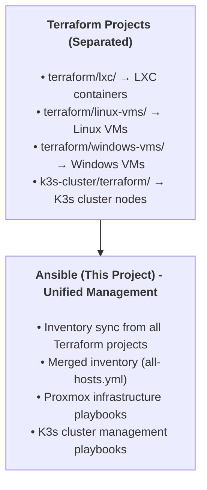

# Ansible Configuration for Proxmox Infrastructure & K3s Cluster

<!-- markdownlint-disable MD013 -->

[](https://www.ansible.com/)
[](https://www.terraform.io/)
[](https://k3s.io/)

<!-- markdownlint-enable MD013 -->

Unified Ansible project for managing Proxmox infrastructure (LXC
containers, Linux VMs, Windows VMs) and K3s cluster.

---

## Overview

This Ansible project integrates infrastructure management across
multiple Terraform projects:

- **LXC Containers** - Docker hosts, DNS servers, and other services
- **Linux VMs** - Virtual machines running Linux
- **Windows VMs** - Domain controllers and Windows services
- **K3s Cluster** - Kubernetes cluster management

### Architecture

<!-- markdownlint-disable MD040 -->



<!-- markdownlint-enable MD040 -->

---

## Quick Start

### 1. Sync Inventories from Terraform

```bash
# Sync all inventories (lxc, linux-vms, windows-vms, k3s)
make inventory-all

# Or sync individually
make inventory-lxc          # LXC containers only
make inventory-linux-vms    # Linux VMs only
make inventory-windows-vms  # Windows VMs only
make inventory-k3s          # K3s cluster only
```

### 2. Accept SSH Host Keys

```bash
make accept-host-keys
```

### 3. Bootstrap Proxmox Hosts

```bash
# Bootstrap a specific LXC container (one-time, as root)
make bootstrap-host HOST=<hostname>

# Configure a specific host (one-time, as maintainer)
make configure-host HOST=<hostname>
```

### 4. Manage K3s Cluster

```bash
# Bootstrap K3s cluster (initial deployment)
make k3s-bootstrap

# Verify cluster health
make k3s-verify

# Update K3s cluster
make k3s-update

# Access cluster (after bootstrap)
export KUBECONFIG=$(pwd)/k3s/kubeconfig/config
kubectl get nodes
```

---

## Inventory Structure

The project uses a **merged inventory** approach:

### Generated Inventory Files

- `inventory/all-hosts.yml` - **Merged inventory** (all hosts from all projects)
- `inventory/lxc-hosts.yml` - LXC containers only
- `inventory/linux-vms-hosts.yml` - Linux VMs only
- `inventory/windows-vms-hosts.yml` - Windows VMs only
- `inventory/k3s-hosts.ini` - K3s cluster nodes (INI format)
- `inventory/bootstrap.yml` - Backward compatibility (LXC, root user)
- `inventory/configure.yml` - Backward compatibility (LXC, maintainer user)

### Inventory Groups

```text
all:
  children:
    proxmox_hosts:
      children:
        lxc_containers:      # LXC containers
        linux_vms:           # Linux VMs
        windows_vms:         # Windows VMs (WinRM)
    k3s_cluster:
      children:
        masters:             # K3s master nodes
        workers:             # K3s worker nodes
```

---

## Makefile Commands

### Inventory Management

<!-- markdownlint-disable MD013 -->

| Command                      | Description                                                |
| ---------------------------- | ---------------------------------------------------------- |
| `make inventory`             | Sync all inventories and merge (alias for `inventory-all`) |
| `make inventory-all`         | Sync and merge all inventories                             |
| `make inventory-lxc`         | Sync LXC inventory only                                    |
| `make inventory-linux-vms`   | Sync Linux VMs inventory only                              |
| `make inventory-windows-vms` | Sync Windows VMs inventory only                            |
| `make inventory-k3s`         | Sync K3s inventory only                                    |

<!-- markdownlint-enable MD013 -->

### Proxmox Infrastructure

<!-- markdownlint-disable MD013 -->

| Command                               | Description                            |
| ------------------------------------- | -------------------------------------- |
| `make bootstrap-host HOST=<hostname>` | Bootstrap specific host (LXC/Linux VM) |

<!-- markdownlint-enable MD013 -->

| `make configure-host HOST=<hostname>` | Configure specific host |
| `make ping` | Test connectivity to all hosts |
| `make ping-host HOST=<hostname>` | Test connectivity to specific host |

### K3s Cluster Management

| Command                  | Description                                |
| ------------------------ | ------------------------------------------ |
| `make k3s-bootstrap`     | Bootstrap K3s cluster (initial deployment) |
| `make k3s-verify`        | Verify cluster health                      |
| `make k3s-update`        | Update K3s cluster (rolling update)        |
| `make k3s-diagnostics`   | Collect cluster diagnostics                |
| `make k3s-restart`       | Restart K3s services (no reboot)           |
| `make k3s-reboot`        | Rolling reboot of cluster nodes            |
| `make k3s-shutdown`      | Gracefully shutdown cluster                |
| `make k3s-system-update` | Update system packages on K3s nodes        |

### Development & Testing

| Command             | Description                      |
| ------------------- | -------------------------------- |
| `make lint`         | Run ansible-lint on playbooks    |
| `make syntax-check` | Validate playbook syntax         |
| `make list-hosts`   | Show all hosts in inventory      |
| `make clean`        | Remove generated files and cache |

---

## Project Structure

```text
ansible/
├── Makefile                    # Comprehensive workflow automation
├── ansible.cfg                 # Ansible configuration (uses all-hosts.yml)
├── playbooks/
│   ├── lxc/                   # LXC/Proxmox infrastructure playbooks
│   │   ├── bootstrap.yml     # Bootstrap Proxmox hosts (LXC/Linux VMs)
│   │   └── configure.yml     # Configure Proxmox hosts
│   └── k3s/                   # K3s cluster playbooks
│       ├── bootstrap-cluster.yml
│       ├── update-cluster.yml
│       ├── verify-cluster.yml
│       ├── diagnostics.yml
│       ├── restart-k3s.yml
│       ├── reboot-cluster.yml
│       ├── shutdown-cluster.yml
│       └── system-update.yml
├── inventory/
│   ├── all-hosts.yml          # AUTO-GENERATED - Merged inventory
│   ├── lxc-hosts.yml          # AUTO-GENERATED - LXC containers
│   ├── linux-vms-hosts.yml    # AUTO-GENERATED - Linux VMs
│   ├── windows-vms-hosts.yml  # AUTO-GENERATED - Windows VMs
│   ├── k3s-hosts.ini          # AUTO-GENERATED - K3s cluster
│   ├── bootstrap.yml          # Backward compatibility
│   └── configure.yml          # Backward compatibility
├── scripts/
│   ├── sync-terraform-inventory.sh  # Sync from all Terraform projects
│   └── merge-inventories.py         # Merge separate inventories
├── roles/                     # Centralized roles directory (Ansible best practice)
│   ├── common_system/          # System updates & dependencies (shared)
│   ├── common_users/           # User management (shared)
│   ├── common_ssh/              # SSH hardening (shared)
│   ├── common_docker/           # Docker installation (shared)
│   ├── common_podman/            # Podman installation (shared)
│   ├── k3s_cluster/            # K3s cluster role
│   └── k3s_system_prep/         # K3s system preparation
├── k3s/                       # K3s cluster management (K3s-specific)
│   ├── kubeconfig/            # Generated kubeconfig (auto-created during bootstrap)
│   │   └── config             # Kubeconfig for cluster access
│   ├── playbooks/             # K3s cluster playbooks
│   └── inventory/             # K3s cluster inventory
├── linux-vms/                 # General Linux VM management (non-K3s)
│   ├── playbooks/             # General Linux VM playbooks
│   └── inventory/             # General Linux VM inventory (from terraform/linux-vms)
├── lxc/                       # LXC container management
│   └── ...
├── lxc/inventory/group_vars/
│   └── all/                   # LXC-specific variables (Docker, Semaphore)
└── k3s/inventory/group_vars/
    ├── all/                   # K3s variables
    └── k3s_cluster/           # K3s-specific variables
```

---

## Workflow

### Proxmox Infrastructure Deployment

1. **Deploy Infrastructure** (Terraform)

   ```bash
   cd ../terraform/lxc && terraform apply
   cd ../terraform/linux-vms && terraform apply
   cd ../terraform/windows-vms && terraform apply
   ```

2. **Sync Inventory**

   ```bash
   cd ../ansible
   make inventory-all
   ```

3. **Bootstrap Hosts** (one-time per host)

   ```bash
   make bootstrap-host HOST=<hostname>  # Creates user, hardens SSH
   make configure-host HOST=<hostname>   # Installs Docker, etc.
   ```

### K3s Cluster Deployment

1. **Deploy K3s Infrastructure** (Terraform)

   ```bash
   cd ../k3s-cluster/terraform && terraform apply
   ```

2. **Sync K3s Inventory**

   ```bash
   cd ../../proxmox-infra/ansible
   make inventory-k3s
   ```

3. **Bootstrap K3s Cluster**

   ```bash
   make k3s-bootstrap  # Initial cluster deployment
   make k3s-verify     # Verify cluster health
   ```

---

## Configuration

### Ansible Configuration (`ansible.cfg`)

- **Inventory**: Uses `inventory/all-hosts.yml` (merged inventory)
- **Connection**: SSH for Linux hosts, WinRM for Windows hosts
- **Security**: Host key checking enabled (production-ready)
- **Performance**: Pipelining, fact caching, SSH multiplexing

### Windows VMs

Windows VMs use **WinRM** for connection:

- Connection type: `winrm`
- Port: `5985` (HTTP) or `5986` (HTTPS)
- User: `Administrator`
- Authentication: SSH keys (via WinRM-OpenSSH)

### K3s Cluster Configuration

K3s cluster management uses dedicated playbooks:

- **Bootstrap**: Initial cluster deployment
- **Update**: Rolling updates (one node at a time)
- **Verify**: Health checks and diagnostics
- **Maintenance**: Restart, reboot, shutdown operations

---

## Integration with Terraform

### Multi-Project Inventory Sync

The sync script (`scripts/sync-terraform-inventory.sh`) fetches inventories
from:

1. `terraform/lxc/` → `inventory/lxc-hosts.yml`
2. `terraform/linux-vms/` → `inventory/linux-vms-hosts.yml`
3. `terraform/windows-vms/` → `inventory/windows-vms-hosts.yml`
4. `k3s-cluster/terraform/` → `inventory/k3s-hosts.ini`

Then merges them into `inventory/all-hosts.yml` using
`scripts/merge-inventories.py`.

### SSH Key Management

- Terraform generates unique SSH keys per host
- Keys stored in `~/.ssh/<hostname>_id_ed25519`
- Ansible inventory references these keys automatically
- Same keys used for bootstrap (root) and configure (maintainer)

---

## Troubleshooting

### Inventory Not Syncing

**Symptom**: Hosts missing from inventory

**Solution**:

```bash
# Check Terraform state
cd ../terraform/lxc && terraform output ansible_inventory_yaml

# Re-sync inventory
cd ../../ansible && make inventory-all
```

### K3s Inventory Not Found

**Symptom**: `make inventory-k3s` fails

**Solution**:

- Ensure K3s Terraform has been applied
- Check if `k3s-cluster/terraform/generated/inventory/hosts.ini` exists
- Or verify symlink at `k3s-cluster/ansible/inventory/hosts.ini`

### Windows VM Connection Issues

**Symptom**: Cannot connect to Windows VMs

**Solution**:

- Verify WinRM is enabled on Windows VMs
- Check firewall rules (port 5985/5986)
- Ensure SSH keys are configured for WinRM-OpenSSH

---

## Migration from Old Structure

If migrating from the old single-project structure:

1. **Backup existing inventory**

   ```bash
   cp -r inventory inventory.backup
   ```

2. **Update sync script** (already done)
   - New script fetches from all 3 Terraform projects

3. **Sync new inventories**

   ```bash
   make inventory-all
   ```

4. **Verify hosts**

   ```bash
   make list-hosts
   make ping
   ```

5. **Update playbook invocations**
   - Old: `-i inventory/terraform.yml`
   - New: `-i inventory/all-hosts.yml` (or use default from ansible.cfg)

---

## Related Documentation

- [Terraform README](../terraform/README.md) - Infrastructure provisioning
- [K3s Cluster Documentation](../../k3s-cluster/README.md) - K3s cluster details
- [Ansible Vault Guide](./docs/ANSIBLE_VAULT.md) - Secret management
- [Tags Reference](./docs/TAGS.md) - Selective execution with tags

---

## License

This project is part of a Proxmox infrastructure management suite.
