# 🐳 Docker Services

<!-- markdownlint-disable MD013 -->

[](https://docs.docker.com/compose/)
[](https://www.gitops.tech/)
[](https://en.wikipedia.org/wiki/CI/CD)

<!-- markdownlint-enable MD013 -->

## Docker Compose Service Definitions

Docker Compose service definitions for automated GitOps deployment.

*Deploy services to production with a simple `git push`*

<!-- markdownlint-disable MD051 -->

[Quick Start](#-quick-start) • [Service Structure](#-service-structure) •
[Creating Services](#-creating-a-new-service) • [Deployment](#deployment)

<!-- markdownlint-enable MD051 -->

---

## 📋 Table of Contents

- [Overview](#-overview)
- [Quick Start](#-quick-start)
- [Service Structure](#-service-structure)
- [Creating a New Service](#-creating-a-new-service)
- [Service Metadata](#-service-metadata)
- [Deployment Process](#-deployment-process)
- [Configuration](#configuration)
- [Secrets Management](#-secrets-management)
- [Best Practices](#-best-practices)
- [Troubleshooting](#-troubleshooting)
- [Service Documentation](#-service-documentation)

---

## 🎯 Overview

This directory contains **Docker Compose service definitions** that are
automatically deployed to Proxmox LXC containers via **GitLab CI/CD**.
Services follow a GitOps workflow where changes to `docker-compose.yml` files
trigger automatic deployments.

### ✨ Key Features

- 🚀 **Automatic Deployment** - Deploy services with a simple `git push`
- 🔍 **Change Detection** - Only deploys services that have changed
- ✅ **Validation** - Validates Docker Compose files before deployment
- 🔄 **Zero-Downtime** - Rolling deployments with health checks
- 📊 **Multi-Environment** - Deploy to different hosts via metadata
- 🔐 **Secure** - Secrets managed via GitLab CI/CD variables and Ansible Vault

### Current Services

- **[pihole-1](./pihole-1/)** - Primary Pi-hole DNS server
- **[pihole-2](./pihole-2/)** - Secondary Pi-hole DNS server
- **[adguard-1](./adguard-1/)** - Primary AdGuard Home DNS server
- **[adguard-2](./adguard-2/)** - Secondary AdGuard Home DNS server
- **[unbound-1](./unbound-1/)** - Primary Unbound DNS resolver
- **[unbound-2](./unbound-2/)** - Secondary Unbound DNS resolver
- **[semaphore](./semaphore/)** - Semaphore CI/CD platform
- **[paperless-ngx](./paperless-ngx/)** - Document management system

---

## ⚡ Quick Start

### Deploy an Existing Service

```bash
# 1. Edit service configuration
vim services/pihole-1/docker-compose.yml

# 2. Commit and push
git add services/pihole-1/docker-compose.yml
git commit -m "feat(pihole-1): update configuration"
git push origin main

# ✨ GitLab CI/CD automatically:
#   1. Detects pihole-1 changed
#   2. Validates docker-compose.yml
#   3. Deploys to target host
#   4. Verifies deployment
#   5. Sends notifications
```

### Create a New Service

```bash
# 1. Create service directory
mkdir -p services/my-service

# 2. Create docker-compose.yml
cat > services/my-service/docker-compose.yml <<EOF
version: '3.8'
services:
  app:
    image: nginx:latest
    container_name: my-service
    restart: unless-stopped
    ports:
      - "80:80"
EOF

# 3. Create .service.yml metadata
cat > services/my-service/.service.yml <<EOF
target_host: pihole-1
EOF

# 4. Commit and push
git add services/my-service/
git commit -m "feat: add my-service"
git push origin main
```

---

## 📁 Service Structure

### Directory Layout

```text
services/
├── README.md                    # ← You are here (this file)
│
├── <service-name>/              # Service directory
│   ├── docker-compose.yml       # Required: Docker Compose configuration
│   ├── .service.yml             # Optional: Deployment metadata
│   └── README.md                # Optional: Service-specific documentation
│
├── dns-1/                       # Primary DNS server
│   ├── docker-compose.yml
│   └── README.md
│
├── dns-2/                       # Secondary DNS server
│   ├── docker-compose.yml
│   └── README.md
│
├── semaphore/                   # CI/CD platform
│   ├── docker-compose.yml
│   └── README.md
│
└── _templates/                  # Service templates
    ├── docker-compose.yml       # Docker Compose template
    └── service-example.yaml     # Service metadata template
```

### Required Files

**`docker-compose.yml`** (Required)

- Docker Compose V2 configuration
- Defines containers, networks, volumes
- Standard Docker Compose format

**`.service.yml`** (Optional but Recommended)

- Deployment metadata
- Target host configuration
- Deployment strategy
- Health check configuration

**`README.md`** (Optional)

- Service-specific documentation
- Access instructions
- Configuration guide
- Troubleshooting tips

---

## 🆕 Creating a New Service

### Step-by-Step Guide

#### Step 1: Create Service Directory

```bash
mkdir -p services/my-service
cd services/my-service
```

#### Step 2: Create Docker Compose File

Copy the template and customize:

```bash
cp ../_templates/docker-compose.yml docker-compose.yml
vim docker-compose.yml
```

**Example**:

```text
version: "3.8"

services:
  app:
    image: nginx:1.25.3
    container_name: my-service
    restart: unless-stopped
    ports:
      - "80:80"
    environment:
      - TZ=${TZ:-UTC}
      - PUID=${PUID:-1000}
      - PGID=${PGID:-1000}
    volumes:
      - ./appdata/config:/config
      - ./appdata/data:/data
    networks:
      - my-service_network
    healthcheck:
      test:
        [
          "CMD",
          "wget",
          "--quiet",
          "--tries=1",
          "--spider",
          "http://localhost:80",
        ]
      interval: 30s
      timeout: 10s
      retries: 3
      start_period: 40s

networks:
  my-service_network:
    name: my-service_network
    driver: bridge
```

#### Step 3: Create Service Metadata

Copy the template and configure:

```bash
cp ../_templates/service-example.yaml .service.yml
vim .service.yml
```

**Minimum Configuration**:

```text
target_host: pihole-1
```

**Full Configuration**:

```text
name: my-service
description: My awesome service

target_host: pihole-1

health_check:
  endpoint: /health
  port: 80
  expected_status: 200

urls:
  web_ui: "http://10.10.0.20:80"
```

#### Step 4: Configure GitLab CI/CD Variables

In GitLab repository settings, add CI/CD variables:

```text
SSH_KEY_WEB_1          # SSH private key for target host
HOST_WEB_1             # IP address of target host
ENV_MY_SERVICE         # Environment variables (optional)
```

**Secret Naming Convention**:

- SSH Key: `web-1` → `SSH_KEY_WEB_1`
- Target Host: `web-1` → `HOST_WEB_1`
- Service Env: `my-service` → `ENV_MY_SERVICE`
- Hyphens become underscores
- Lowercase becomes uppercase

#### Step 5: Create Service Documentation

```bash
cat > README.md <<EOF
# My Service

Brief description of the service.

## Access

- Web UI: http://10.10.0.20:80

## Configuration

Environment variables are managed via GitLab CI/CD variables.

## Troubleshooting

Check logs:
\`\`\`bash
ssh maintainer@10.10.0.20
cd /srv/docker/my-service
docker compose logs
\`\`\`
EOF
```

#### Step 6: Commit and Deploy

```bash
git add services/my-service/
git commit -m "feat: add my-service"
git push origin main

# ✨ GitLab CI/CD automatically deploys!
```

---

## 📝 Service Metadata

### `.service.yml` File

The `.service.yml` file provides deployment metadata for GitLab CI/CD.
It's optional but highly recommended.

### Required Fields

```text
target_host: web-1 # Must match Ansible inventory hostname
```

### Optional Fields

```text
# Service identification
name: my-service
description: My awesome service

# Deployment target
target_host: pihole-1

# Health check configuration
health_check:
  endpoint: /health
  port: 80
  expected_status: 200
  timeout: 10

# Service URLs (for documentation)
urls:
  web_ui: "http://10.10.0.20:80"
  api: "http://10.10.0.20:80/api"

# Resource requirements (for documentation)
resources:
  cpu: "1"
  memory: "1GB"
  disk: "5GB"

# Tags for organization
tags:
  - web
  - production
```

### Deployment Strategies

#### Rolling (Recommended)

- Zero downtime
- Updates containers in-place
- Best for stateless services
- Command: `docker compose up -d --remove-orphans`

#### Recreate

- Brief downtime
- Stops all containers before starting new ones
- Best for stateful services or major updates
- Command: `docker compose down && docker compose up -d`

---

## 🚀 Deployment Process

### Automatic Deployment Flow

```mermaid
---
title: GitOps Deployment Flow
---

flowchart TD
    push["1. Developer pushes code<br/><code>git push origin main</code>"]

    ci["2. GitLab CI/CD triggered<br/>• Detects changed files<br/>• Validates docker-compose.yml<br/>• Identifies changed services"]

    deploy["3. For each changed service:<br/>• Read .service.yml metadata<br/>• Load SSH keys and secrets<br/>• SSH to target host<br/>• Copy docker-compose.yml<br/>• Deploy .env file (if configured)<br/>• Validate configuration<br/>• Run docker compose up -d<br/>• Verify containers are running"]

    notify["4. Send notification (Discord)<br/>• Deployment status<br/>• Commit information<br/>• Service details"]

    push --> ci --> deploy --> notify

```

<!-- markdownlint-disable MD040 -->



<!-- markdownlint-enable MD040 -->

### Change Detection

GitLab CI/CD detects changes by:

1. Comparing current commit with previous commit
2. Filtering for files in `services/` directory
3. Excluding `services/templates/` directory
4. Extracting service names from changed paths

**Example**:

- Changed file: `services/dns-1/docker-compose.yml`
- Detected service: `dns-1`

### Deployment Steps

For each changed service:

1. **Read Metadata**: Parses `services/<service>/.service.yml`
2. **Load Secrets**: Retrieves SSH keys and environment variables
3. **Setup SSH**: Creates temporary SSH key file
4. **Test Connectivity**: Verifies SSH connection
5. **Create Directory**: Ensures `/srv/docker/<service>/` exists
6. **Copy Files**: Transfers `docker-compose.yml` to target host
7. **Deploy Environment**: Creates `.env` file from secrets (if configured)
8. **Validate Config**: Runs `docker compose config --quiet`
9. **Deploy**: Executes deployment strategy
10. **Verify**: Checks containers are running
11. **Cleanup**: Removes temporary SSH keys

---

## ⚙️ Configuration

### Docker Compose Configuration Guidelines

#### Use Specific Image Versions

```text
# ✅ Good
image: nginx:1.25.3

# ❌ Bad
image: nginx:latest
```

#### Include Health Checks

```text
healthcheck:
  test:
    ["CMD", "wget", "--quiet", "--tries=1", "--spider", "http://localhost:80"]
  interval: 30s
  timeout: 10s
  retries: 3
  start_period: 40s
```

#### Use Restart Policies

```text
restart: unless-stopped # Recommended for most services
# Other options: always, on-failure, no
```

#### Configure Resource Limits

```text
deploy:
  resources:
    limits:
      cpus: "1"
      memory: 1G
    reservations:
      cpus: "0.5"
      memory: 512M
```

#### Use Named Networks

```text
networks:
  my-service_network:
    name: my-service_network
    driver: bridge
```

### Environment Variables

Environment variables can be provided via:

1. **GitLab CI/CD Variables**: `SERVICE_ENV_<SERVICE_NAME>`
2. **`.env` file**: Generated from secrets during deployment
3. **Docker Compose**: Direct definition in `docker-compose.yml`

**Example**:

```text
environment:
  - TZ=${TZ:-UTC}
  - PUID=${PUID:-1000}
  - PGID=${PGID:-1000}
  - DATABASE_URL=${DATABASE_URL}
```

---

## 🔐 Secrets Management

### GitLab CI/CD Variables

For each service, configure CI/CD variables in GitLab repository settings:

#### SSH Authentication

```text
SSH_PRIVATE_KEY_<TARGET_HOST>
```

- **Description**: Private SSH key for connecting to target host
- **Format**: Private key content (RSA, ED25519, etc.)
- **Example**: `SSH_PRIVATE_KEY_SEMAPHORE_1`

#### Target Host Configuration

```text
TARGET_IP_<TARGET_HOST>
```

- **Description**: IP address or hostname of target host
- **Format**: IP address (e.g., `10.10.0.10`) or hostname
- **Example**: `TARGET_IP_SEMAPHORE_1`

#### Service Environment Variables

```text
SERVICE_ENV_<SERVICE_NAME>
```

- **Description**: Environment variables for the service (`.env` file content)
- **Format**: Multi-line string (key=value pairs)
- **Example**: `SERVICE_ENV_SEMAPHORE_1`
- **Optional**: Omit if service doesn't need environment variables

**Example `.env` content**:

```text
DNS_SERVER_ADMIN_PASSWORD=secure_password_123
DNS_SERVER_ALLOWED_IPS=10.10.0.0/24
LOG_LEVEL=info
```

### Secret Naming Convention

Secrets follow this pattern:

- **SSH Key**: `SSH_PRIVATE_KEY_<HOST>` (uppercase, underscores)
- **Target IP**: `TARGET_IP_<HOST>` (uppercase, underscores)
- **Environment**: `SERVICE_ENV_<SERVICE>` (uppercase, underscores)

**Transformation Rules**:

- Service/host name: `semaphore-1` → `SEMAPHORE_1`
- Hyphens → Underscores
- Lowercase → Uppercase

---

## ✅ Best Practices

### Service Development

#### Service Development Best Practices

- **Pin image versions** - Use specific tags, not `latest`
- **Add health checks** - Include health check configuration
- **Use restart policies** - Set appropriate restart policy
- **Document services** - Create README.md for each service
- **Test locally** - Validate docker-compose.yml before pushing
- **Use named networks** - Create dedicated networks for services
- **Configure resource limits** - Set CPU and memory limits
- **Use volumes** - Persist data with named volumes

#### Service Development Anti-Patterns

- **Don't use `latest` tags** - Pin specific versions
- **Don't skip health checks** - Always include health checks
- **Don't hardcode secrets** - Use environment variables
- **Don't commit `.env` files** - Use GitLab CI/CD variables
- **Don't ignore errors** - Investigate deployment failures
- **Don't deploy untested code** - Test locally first

### Docker Compose Configuration

#### Docker Compose Best Practices

- **Use Docker Compose V2** - Use `docker compose` (not `docker-compose`)
- **Version your compose files** - Specify `version: '3.8'`
- **Use environment variables** - For configuration
- **Configure logging** - Set up log rotation
- **Use health checks** - For all services
- **Set resource limits** - Prevent resource exhaustion

#### Docker Compose Anti-Patterns

- **Don't use deprecated syntax** - Follow Docker Compose V2 format
- **Don't expose unnecessary ports** - Only expose required ports
- **Don't run as root** - Use non-root users when possible
- **Don't ignore security updates** - Keep images updated

### Git Workflow

#### Git Workflow Best Practices

- **Use feature branches** - Create branches for changes
- **Write descriptive commits** - Clear commit messages
- **Review before merging** - Review changes in PRs
- **Keep commits atomic** - One logical change per commit
- **Use conventional commits** - `feat:`, `fix:`, `docs:`, etc.

#### Git Workflow Anti-Patterns

- **Don't force push to main** - Protect main branch
- **Don't commit large files** - Use Git LFS if needed
- **Don't skip CI/CD** - Let workflows run before merging

---

## 🐛 Troubleshooting

### Deployment Failures

#### "Cannot connect to target host"

**Symptoms**: SSH connection fails during deployment

**Solutions**:

1. Verify `TARGET_IP_<HOST>` secret is correct
2. Test SSH connection manually:

   ```bash
   ssh -i ~/.ssh/key user@target-ip
   ```

3. Check network connectivity
4. Verify firewall rules allow SSH (port 22)

#### "Docker Compose validation failed"

**Symptoms**: `docker compose config` fails

**Solutions**:

1. Validate locally:

   ```bash
   docker compose -f services/my-service/docker-compose.yml config
   ```

2. Check YAML syntax (indentation, quotes)
3. Verify Docker Compose version compatibility
4. Check for missing environment variables

#### "Deployment failed - containers not running"

**Symptoms**: Deployment completes but containers aren't running

**Solutions**:

1. Check container logs:

   ```bash
   ssh maintainer@target-ip
   cd /srv/docker/my-service
   docker compose logs
   ```

2. Verify environment variables are set correctly
3. Check for port conflicts
4. Verify volume mounts exist and have correct permissions

### Service Issues

#### "Service not accessible"

**Solutions**:

1. Check service is running:

   ```bash
   docker compose ps
   ```

2. Verify ports are exposed correctly
3. Check firewall rules
4. Verify service is listening on correct port

#### "Health check failing"

**Solutions**:

1. Test health check endpoint manually:

   ```bash
   curl http://localhost:80/health
   ```

2. Verify health check configuration in docker-compose.yml
3. Check service logs for errors
4. Verify service is ready before health check starts

### Secret Issues

#### "Missing secrets: SSH_PRIVATE_KEY_XXX"

**Solutions**:

1. Verify secret name matches naming convention
2. Check variable exists in GitLab repository settings
3. Verify secret value is not empty
4. Check secret name transformation (hyphens → underscores, lowercase →
   uppercase)

---

## 📚 Service Documentation

Each service should have its own `README.md` with:

- **Overview** - What the service does
- **Access** - How to access the service (URLs, ports)
- **Configuration** - How to configure the service
- **Deployment** - Deployment instructions
- **Troubleshooting** - Common issues and solutions

### Current Service Documentation

- **[dns-1 README](./dns-1/README.md)** - Primary DNS server documentation
- **[dns-2 README](./dns-2/README.md)** - Secondary DNS server documentation
- **[semaphore README](./semaphore/README.md)** - CI/CD platform documentation

### Template

````markdown
# Service Name

Brief description of the service.

## Overview

- **Container**: service-name
- **IP Address**: 10.10.0.20
- **Web UI**: http://10.10.0.20:80
- **Image**: nginx:latest

## Access

### Web UI

```text
http://10.10.0.20:80
```
````

## Configuration

Environment variables are managed via GitLab CI/CD variables.

## Deployment

### Automatic Deployment

```bash
# Edit service configuration
vim services/service-name/docker-compose.yml

# Commit and push
git add services/service-name/
git commit -m "feat(service-name): update configuration"
git push origin main
```

## Troubleshooting

Check logs:

```bash
ssh maintainer@10.10.0.20
cd /srv/docker/service-name
docker compose logs
```

---

## 🔗 Related Documentation

- **[Main README](../README.md)** - Complete project documentation
- **[GitLab CI/CD Configuration](../.gitlab-ci.yml)** - CI/CD pipeline
  configuration
- **[Terraform README](../terraform/README.md)** - Infrastructure provisioning
- **[Ansible README](../ansible/README.md)** - Configuration management

---

## Footer

Made with ❤️ for automated service deployment

<!-- markdownlint-disable MD013 -->

[](https://www.docker.com/)
[](https://www.gitops.tech/)
[](https://en.wikipedia.org/wiki/CI/CD)

<!-- markdownlint-enable MD013 -->
